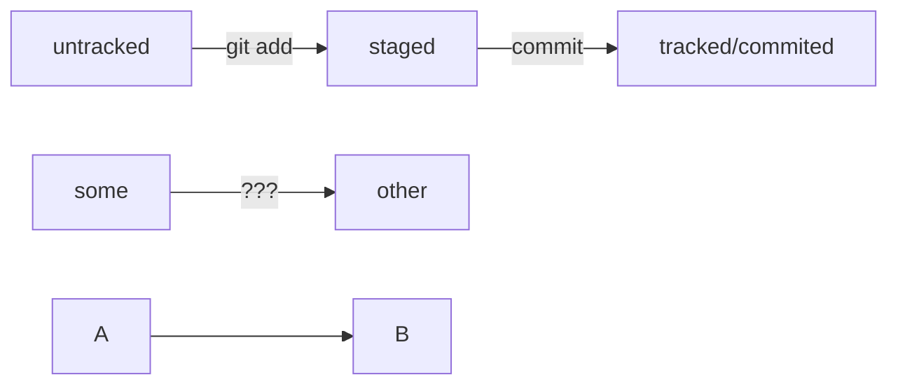

# Работа с Git
---
## Локальный репозиторий.
* Создаём директорию проекта.
* Создаём файлы проекта.
* Инициализируем репозиторий
```bash
git init
```
* Проверяем состояние репозитория
```bash
git status
```
* Добавляем файлы в _отслеживание_.
```bash
git add --all
```
* Делаем commit.
```bash
git commit -m "Описание"
```
---
## Удалённый репозиторий.
1. Зарегистрироваться в GitHub по [ссылке](https://github.com/ "Главная страница gh.")
2. Создать **ssh-ключи**, __репозиторий__, 
привязать удалённый репозиторий git remote add origin git@github.com:%ИМЯ_АККАУНТА%/
%ИМЯ_ПРОЕКТА%, сделать **push** в удалённый репозиторий в нужную ветку.


